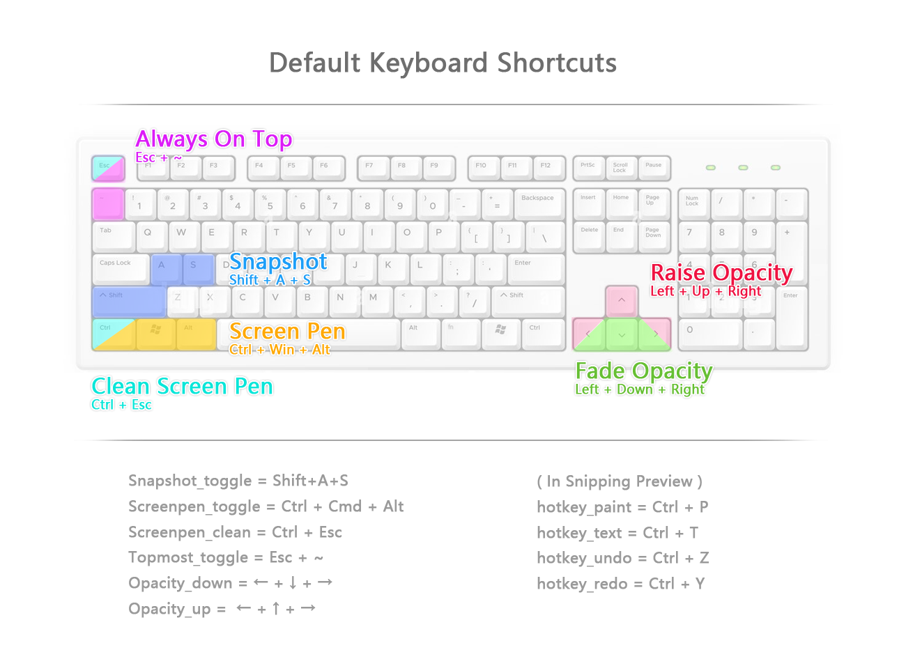

# Fastshot

Fastshot is a GenAI powered screenshot and annotation tool designed to optimize your workflow. Ideal for students, developers, researchers, and operations professionals, Fastshot enhances multitasking by providing seamless, efficient tools to capture, pin, annotate, and analyze screen content.

With its "pin on top" feature, Fastshot allows users to keep screenshots easily accessible while enabling smooth zooming, moving, annotation, and copying for multi-system comparisons. The built-in OCR tool enables quick extraction of text from any part of the screen, further streamlining your workflow.

Additionally, Fastshot’s GenAI-powered assistant offers advanced analysis and summarization of screen content, allowing users to extract information and ask questions with ease, significantly boosting productivity.

The tool also includes a Screen Pen feature, window pinning capabilities, and customizable window opacity adjustments—perfect for managing complex workflows across multiple windows and tasks.

## Table of Contents
- [Features](#features)
- [Installation](#installation)
- [Usage](#usage)
- [Shortcuts](#shortcuts)
- [Plugin Mechanism](#plugin-mechanism)
- [Who Can Benefit](#who-can-benefit)
  - [Students](#students)
  - [Developers](#developers)
  - [Researchers](#researchers)
  - [Operations Personnel](#operations-personnel)
- [Contributing](#contributing)
- [License](#license)


## Features

### Screenshot and Annotation
- **Always on Top**: Keep screenshots above all other windows for easy comparison.
- **Smooth Zoom and Drag**: Effortlessly zoom and drag screenshots to focus on details.
- **Annotation Tools**: Hand-drawing and text mode for quick annotations.
- **Clipboard Export**: Easily export screenshots to the clipboard for sharing.
- **OCR Integration**: Extract text from images using the built-in OCR plugin powered by PaddleOCR running locally.
- **AI Assistant**: Ask questions about the screenshot using the integrated GenAI assistant.

### Context Menu Options
- ❌ **Close**: Close the current window.
- 💾 **Save As...**: Save the current screenshot.
- 🖌️ **Paint**: Activate paint mode for freehand drawing.
- ↩️ **Undo**: Undo the last action.
- 🚪 **Exit Edit**: Exit paint or text mode.
- 📋 **Copy**: Copy the current screenshot to the clipboard.
- 🔤 **Text**: Activate text mode to add text annotations.
- 🔍 **OCR**: Perform OCR on the current screenshot and copy the result to the clipboard.

### System Window Control
- 📌 **Always on Top**: Toggle the window's always-on-top state.
- 🔍 **Window Transparency Adjustment**: Adjust transparency of any system window via hotkeys for better multitasking.

### Screen Annotation
- 🖊️ **Screen Pen**: Activate the screen pen to annotate anywhere on your screen.

### GenAI Assistant
- **Multimodal AI Assistant**: Seamlessly integrated AI assistant that can read any content on your screen and answer your questions.

## Installation

You can install Fastshot from PyPI:

```bash
pip install fastshot
```


## Usage
Once installed, you can start Fastshot from the command line:
```bash
fastshot
```

## LLM Env Variable  (2 way)

### OpenAI Standard:
```bash
setx OPENAI_TOKEN "sk-kK"
setx OPENAI_MM_URL "https://xxx"
setx OPENAI_CHATGPT_URL "https://xxx"
setx HEAD_TOKEN_KEY "Authorization"
```
### Standalone Token Exchange:
```bash
setx OPENAI_TOKEN_URL ""
setx OPENAI_USER_NAME ""
setx OPENAI_PASSWORD ""
setx OPENAI_APPLICATION_ID ""
setx OPENAI_APPLICATION_NAME ""
setx OPENAI_MM_URL "https://xxx"
setx OPENAI_CHATGPT_URL "https://xxx"
setx HEAD_TOKEN_KEY "Authorization"

setx OPENAI_HEALTH_URL ""
```

## Shortcuts
Customize your experience with configurable shortcuts. Most operations require only a single hotkey, minimizing the need for repetitive touch points.



```ini
[Shortcuts]
hotkey_snip = <shift>+a+s
hotkey_paint = <ctrl>+p
hotkey_text = <ctrl>+t

hotkey_screenpen_toggle = <ctrl>+<cmd>+<alt>
hotkey_undo = <ctrl>+z
hotkey_redo = <ctrl>+y
hotkey_screenpen_exit = <esc>
hotkey_screenpen_clear_hide = <ctrl>+<esc>

hotkey_topmost_on = <esc>+`
hotkey_topmost_off = <cmd>+<shift>+\

hotkey_opacity_down = <left>+<right>+<down>
hotkey_opacity_up = <left>+<right>+<up>

[ScreenPen]
enable_screenpen = True
pen_color = red
pen_width = 3
```


## Who Can Benefit

### Students
- **Note-Taking**: Quickly capture and annotate lecture slides or online resources.
- **Collaboration**: Share annotated screenshots with classmates for group projects.
- **Study Aid**: Study Aid: Use the OCR feature to extract text from images for easier studying.
- **7x24 Teacher**: Use the Multimodal GenAI feature to play as a teacher, ask any question that confused you.


### Developers
- **Debugging**: Capture error messages and annotate code snippets.
- **Documentation**: Create annotated screenshots for documentation or tutorials.
- **Multitasking**: Keep reference materials always on top while coding.
- **Coding Copilot**: Generate code directly based on the diagram or UI Design.


### Researchers
- **Data Collection**: Capture and annotate data from various sources.
- **Multi Reference Reading**: Read through multiple Reference paper at the same time.
- **Analysis**: Use the AI assistant to interpret complex diagrams or charts.
- **Organization**: Quickly extract text from images to compile research notes.

### Operations Personnel
- **Efficiency**: Reduce the need for frequent window switching with always-on-top screenshots.
- **Quality Assurance**: Annotate and compare data across different systems.
- **Data Entry:**: Use OCR to minimize manual data entry errors.
- **Decision Making**: Quickly locate key elements in free-format documents.


## Development
### Setting Up the Development Environment
1. Clone the repository:
```bash
git clone https://github.com/jimeverest/fastshot.git
cd fastshot
```
2. Install the dependencies:
```bash
pip install -r requirements.txt
```

### Running Tests
You can run the tests using:
```bash
pytest tests/
```

## Contributing
We welcome contributions from the community! Please read our Contributing Guide to learn how you can help improve Fastshot.

## License
Fastshot is released under the MIT License.

## How Fastshot Enhances Multitasking
Fastshot is designed to seamlessly integrate into your workflow without altering your existing systems or data structures. Here's how it helps:

- **Non-Intrusive Workflow**: Fastshot works as a desktop application, so you don't need to change your current workflow.
- **Quick Access**: With customizable hotkeys, you can perform most operations swiftly, without interrupting your tasks.
- **Data Integration**: Easily extract and manipulate data from screenshots, enhancing productivity.
- **GenAI Integration**: The GenAI assistant provides intelligent responses and insights, reducing the time spent on manual analysis.

By providing powerful tools for capturing, annotating, and sharing screen content, Fastshot is an indispensable asset for anyone who requires efficient multitasking capabilities in their daily activities.


## Plugin Mechanism
Fastshot supports a plugin mechanism, allowing for functionality extensions to meet various business needs. You can develop custom plugins to enhance or modify the tool's capabilities.

1. Create a Plugin Class: Your plugin should be a Python class with the desired functionality. For example, an OCR plugin might look like this:
```python
from paddleocr import PaddleOCR
from PIL import Image
import win32clipboard
import tkinter as tk

class PluginOCR:
    def __init__(self):
        self.ocr_engine = PaddleOCR(use_angle_cls=True, lang='en')

    def ocr(self, image):
        result = self.ocr_engine.ocr(image, cls=True)
        ocr_text = "\n".join([line[1][0] for res in result for line in res])
        self.copy_to_clipboard(ocr_text)
        return ocr_text

    def copy_to_clipboard(self, text):
        win32clipboard.OpenClipboard()
        win32clipboard.EmptyClipboard()
        win32clipboard.SetClipboardText(text, win32clipboard.CF_UNICODETEXT)
        win32clipboard.CloseClipboard()

    def show_message(self, message, parent):
        label = tk.Label(parent, text=message, bg="yellow", fg="black", font=("Helvetica", 10))
        label.pack(side="bottom", fill="x")
        parent.after(3000, label.destroy)
```
2. Register the Plugin: In the SnipasteApp class, you can register your plugin by adding it to the plugin list.
```python
class SnipasteApp:
    def load_plugins(self):
        plugin_modules = ['fastshot.plugin_ocr']  # Add your plugin module here
        for module_name in plugin_modules:
            module = importlib.import_module(module_name)
            plugin_class = getattr(module, 'PluginOCR')
            self.plugins[module_name] = plugin_class()
```

3. Invoke the Plugin: You can invoke the plugin from your application code, such as from a menu item.
```python
def ocr(self):
    plugin = self.app.plugins.get('fastshot.plugin_ocr')
    if plugin:
        img_path = 'temp.png'
        self.img_label.zoomed_image.save(img_path)
        result = plugin.ocr(img_path)
        plugin.show_message("OCR result updated in clipboard", self.img_window)
```
By following these steps, you can create and integrate custom plugins to extend the functionality of Fastshot.


## Todo:
1. ~~tk window force trigger~~
2. ~~ppocr[Default]~~
3. ~~screenpen integration~~
4. hyder
5. ~~transprent window~~
6. ~~fixed on top~~
7. pyinstaller
8. ~~gdt-4o multimodal task(OCR/QA)~~
9. UI(PySimpleGUI/WebPortal)
10. TTS/STT
11. ~~openai-llm-adoption~~
12. ~~Documents~~
13. ~~config-env~~
